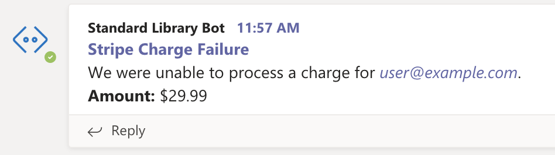
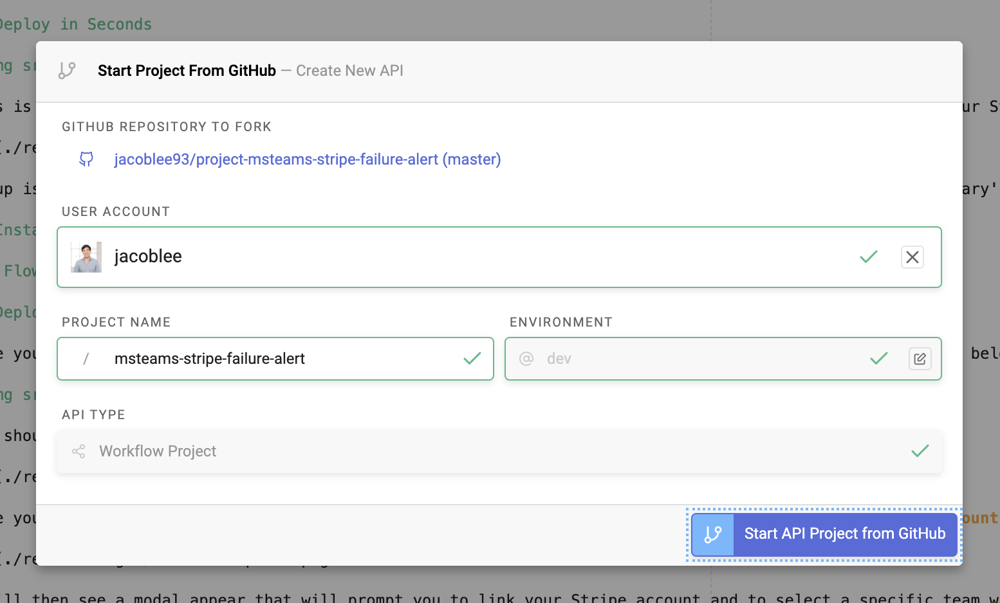
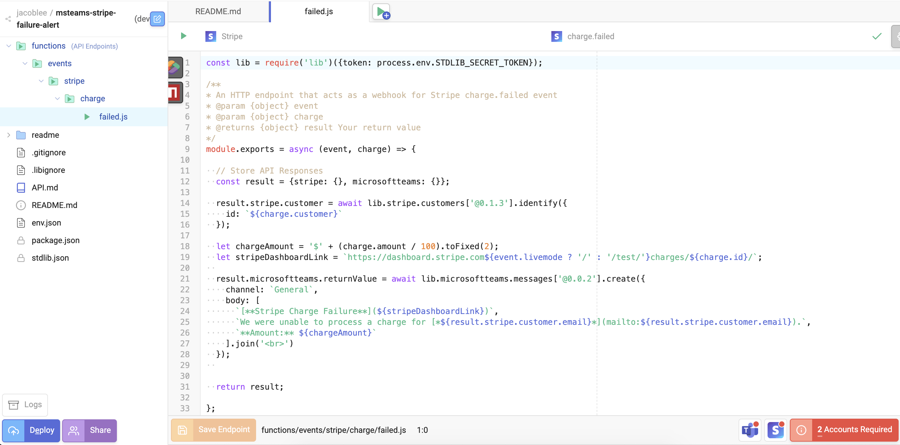

# Microsoft Teams Stripe Charge Failure Alert Bot

## Deploy in Seconds

This is a Microsoft Teams bot that will send a message to your channel when a charge fails to process on your Stripe account. It contains the customer's email, the amount of the charge, and a link to the failed payment in the Stripe dashboard for further examination.

Setup is simple –– you can deploy it without writing any code or configuring any files due to Standard Library's [Identity Token](https://docs.stdlib.com/identity-management-sso-for-apis/what-is-an-identity-token/) support! You will need to add the Standard Library bot to your Microsoft Teams organization, link your Stripe account to Standard Library, and deploy.

## Installing Your Bot Into Teams

`// Flow pending`

## Deploying to Standard Library

Once you've and installed the Standard Library app into your Microsoft Teams organization, click the button below to open this repo in [Autocode](https://autocode.stdlib.com/):

You should see a screen like this:

Save your project, then open `functions/events/stripe/charge/failed.js` in the sidebar and click the red **2 Accounts Required** button in the lower right corner.

You'll then see a modal appear that will prompt you to link your Stripe account and to select a specific team within your Microsoft Teams organization where you would like to receive alerts.

Once you've linked the required resources, you can press the green **Run Code** button to test your endpoint.

Once you've verified things are working, press the blue **Deploy** button to deploy your project live.

That's it, you're all done! Your bot should be ready to go.

# Thank You!

Please check out [Standard Library](https://stdlib.com/) or follow us on Twitter,
[@StdLibHQ](https://twitter.com/@StdLibHQ).